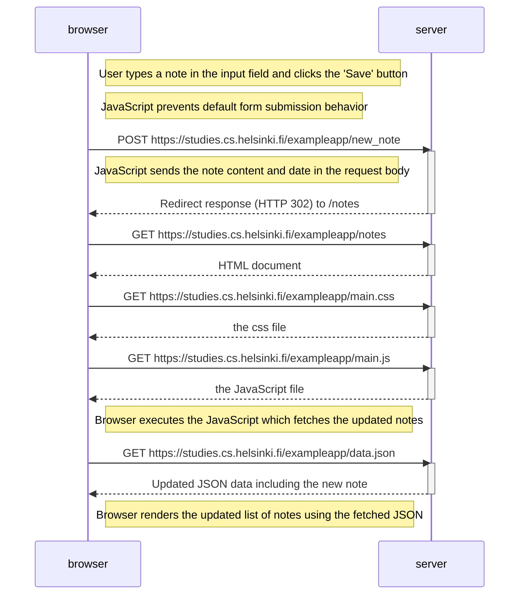

```mermaid
sequenceDiagram
    participant browser
    participant server

    Note right of browser: User types a note in the input field and clicks the 'Save' button

    Note right of browser: JavaScript prevents default form submission behavior

    browser->>server: POST https://studies.cs.helsinki.fi/exampleapp/new_note
    activate server
    Note right of browser: JavaScript sends the note content and date in the request body
    server-->>browser: Redirect response (HTTP 302) to /notes
    deactivate server

    browser->>server: GET https://studies.cs.helsinki.fi/exampleapp/notes
    activate server
    server-->>browser: HTML document
    deactivate server

    browser->>server: GET https://studies.cs.helsinki.fi/exampleapp/main.css
    activate server
    server-->>browser: the css file
    deactivate server

    browser->>server: GET https://studies.cs.helsinki.fi/exampleapp/main.js
    activate server
    server-->>browser: the JavaScript file
    deactivate server

    Note right of browser: Browser executes the JavaScript which fetches the updated notes

    browser->>server: GET https://studies.cs.helsinki.fi/exampleapp/data.json
    activate server
    server-->>browser: Updated JSON data including the new note
    deactivate server

    Note right of browser: Browser renders the updated list of notes using the fetched JSON
```
